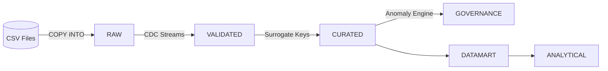

# Enterprise Healthcare Analytics & Patient Insights Data Platform

This repository contains a complete, production-ready, end-to-end **Snowflake Data Platform** designed for Healthcare Analytics. 

It takes raw healthcare data (Patients, Appointments, Medical Records, Billing) and transforms it through a highly automated, governed pipeline into C-Suite level Executive Dashboards.

## 🚀 Architecture Flow

This project implements a multi-layered **Medallion Architecture**, adapted with advanced Data Governance and Data Marts layers. It operates entirely within Snowflake using native capabilities (no external ETL tools required).

### The 6 Layers
1. **`RAW`**: Untouched data ingested directly from source CSVs. Change Data Capture (CDC) Streams are attached to these tables to detect only new records.
2. **`VALIDATED`**: The data cleaning layer. Records are deduplicated. Bad data (e.g., missing PII, invalid dates, negative billing amounts) is actively quarantined and routed to a Governance Exception Log instead of crashing the pipeline.
3. **`CURATED`**: The dimensional modeling layer. It tracks historical changes using **Slowly Changing Dimensions (SCD Type 2)** on Patient data and links Fact tables using `UUID` Surrogate Keys.
4. **`GOVERNANCE`**: An automated Anomaly Engine that scans the clean data for business process violations (e.g., overlapping appointments, extreme billing outliers).
5. **`DATAMART`**: Business-facing views that abstract away complex SQL joins. It provides instant access to Patient 360, Revenue Trends, Risk Predictions, and No-Show Analysis.
6. **`ANALYTICAL`**: Single-metric Executive KPIs built on top of the Datamarts for instant visualization.

## 🛠️ Key Technologies & Snowflake Features Used
* **Snowflake Streams**: Real-time Change Data Capture (CDC) for micro-batch processing.
* **Snowflake Tasks (DAGs)**: Automated orchestration chaining stored procedures together.
* **Stored Procedures**: Complex transformation logic, Data Quality filtering, and SCD-2 `MERGE` commands written in Snowflake Scripting.
* **Snowflake Alerts**: System alerts that trigger email notifications when critical business anomalies are detected.
* **Explicit ACID Transactions**: Stored procedures are wrapped in `BEGIN TRANSACTION` and `COMMIT/ROLLBACK` blocks to guarantee data integrity.

## 📂 Repository Structure

* `healthcare_advanced_pipeline.sql`: The master SQL script containing the full DDL, DML, Stored Procedures, Tasks, and Alerts.
* `generate_datasets.ps1`: A PowerShell script to programmatically generate dummy healthcare data with deliberately injected anomalies to test the pipeline's robustness.
* `data_files/`: Generated sample CSV datasets.

## 🏃‍♂️ How to Run the Project

1. **Generate Data**: Run the `generate_datasets.ps1` PowerShell script locally to create the CSV files in a `data_files` folder.
2. **Setup Architecture**: Open `healthcare_advanced_pipeline.sql` in Snowsight and run the setup commands (Database, Warehouse, Schemas, and the RAW layer).
3. **Upload Files**: Using the Snowflake UI (or SnowSQL), upload the 4 generated CSV files into the internal stage: `@external_stages.healthcare_stage`.
4. **Ingest Data**: Execute the explicit `COPY INTO` commands in the SQL script to load the CSVs into the RAW tables.
5. **Compile Logic**: Run the rest of the SQL script to compile the Stored Procedures, Tasks, Datamarts, and Alerts.
6. **Enable Automation**: Ensure the final `ALTER TASK ... RESUME` commands are executed. Within 1 minute, the DAG will trigger, data will flow across all 6 schemas, anomalies will be quarantined, and the `ANALYTICAL` KPIs will be fully populated!
